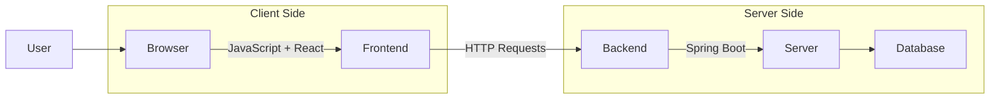
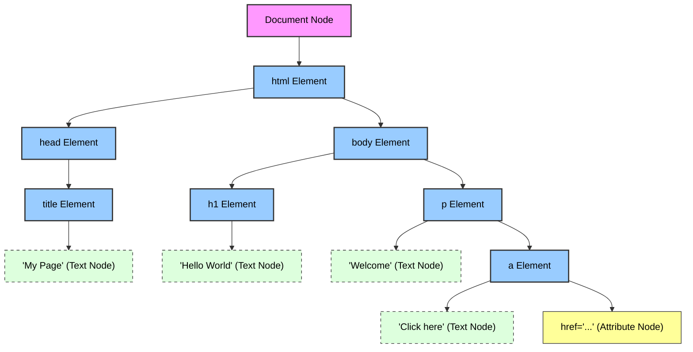

# JavaScript

## Table of Contents

1.  [**Introduction to JavaScript**](#1-introduction-to-javascript)
2.  [**Variables and Data Types**](#2-variables-and-data-types)
3.  [**Operators and Expressions**](#3-operators-and-expressions)
4.  [**Control Flow**](#4-control-flow)
5.  [**Functions**](#5-functions)
6.  [**Arrays**](#6-working-with-arrays)
7.  [**Objects and JSON**](#7-objects-and-json)
8.  [**Error Handling**](#8-error-handling)
9.  [**Dates and Global Objects**](#9-dates-and-global-objects)
10. [**Asynchronous JavaScript**](#10-asynchronous-javascript)
11. [**The Browser Object Model (BOM)**](#11-the-browser-object-model-bom)
12. [**DOM Introduction**](#12-dom-introduction)
13. [**Event Handling**](#13-event-handling)
14. [**Fetch API and Calling APIs**](#14-fetch-api-and-calling-apis)

---


### 1. Introduction to JavaScript

#### What is JavaScript?
JS is a popular programming language used to make websites interactive.
- Interactive means something that responds to your actions or input instead of just showing static content.

JavaScript is a high-level, interpreted programming language that runs mainly in web browsers. 
It is a core technology of the World Wide Web, alongside HTML and CSS.

It allows developers to:

- Add interactivity (buttons, forms, sliders)
- Update content dynamically without reloading the page
- Create games, animations, and web apps

**High-level**: Focuses on being easy to read and write, handling complex details like memory management (e.g.,
  garbage collection) automatically.  
**Interpreted**: Code is executed line by line by a runtime engine without needing an ahead-of-time compilation step.  
**Multi-paradigm**: Supports event-driven, functional, and object-oriented programming styles.  
**Versatile**: Used for both client-side (browser) and server-side (Node.js) development.  

> **Note**: JavaScript can be used for backend development (with Node.js), but it will **not** be used for the backend in this course.  
> Instead, Spring Boot will be used for the server-side logic and APIs.  
> The frontend will use JavaScript and React to build interactive user interfaces.



#### Running JavaScript (Node.js vs. Browser)

JavaScript can run in different environments, each providing its own set of tools and APIs.

**1. Browser Environment**

- **Purpose**: Used for client-side development to make web pages interactive and dynamic (e.g., animations, form
  validation).
- **Global Object (`window`)**: Think of this as the "boss" or container that holds everything the browser provides to
  your script.
- **Key APIs**:
    - **DOM (Document Object Model)**: Allows JavaScript to change things on the page (like updating text or colors).
    - **Fetch API**: Lets you send or receive data from a server.
    - **LocalStorage**: A small "notebook" where your browser can remember things even if you refresh the page.
- **Security**: For your safety, the browser prevents JavaScript from accessing your computer's private files or
  hardware directly.

**2. Node.js Environment**

- **Purpose**: A runtime environment that allows JavaScript to run on a server or your local computer, outside of a web
  browser.
- **Global Object (`global`)**: Similar to `window` in the browser, but specifically for server-side tasks.
- **Key APIs**:
    - **File System (`fs`)**: Allows you to read, create, or delete files on your computer.
    - **Network (`http`)**: Used to create web servers that can handle requests from users.
    - **Operating System (`os`)**: Provides information about the computer's memory, CPU, and more.
- **Use Case**: Building web servers, creating command-line tools, and automating repetitive tasks on your computer.

### 2. Variables and Data Types

JavaScript variables are containers for storing data values.

#### `var`, `let`, and `const`

- **`let`**: Modern way to declare variables that **can change** later. It is "block-scoped," meaning it only exists
  within the `{}` where it was created.
- **`const`**: Short for "constant." Use this for values that **should not change**. It's the safest choice by default.
- **`var`**: The old way (pre-2015). It has some confusing behaviors (like being "hoisted"), so it is generally avoided
  in modern JavaScript.

**Example:**

```javascript
let score = 10;   // Can be changed
score = 15;       // OK!

const pi = 3.14;  // Cannot be changed
// pi = 3.15;     // Error!
```

#### Dynamic Typing and `typeof` operator

JavaScript is **dynamically typed**. You don't need to specify the data type (number, text, etc.) when you create a
variable. The runtime figures it out automatically.

- **`typeof`**: Use this operator to check what type of data a variable holds.

**Example:**

```javascript
let data = "Hello";
console.log(typeof data); // "string"

data = 42;
console.log(typeof data); // "number"
```

#### Primitive Types

The most basic building blocks of data in JavaScript:

- **Number**: Both whole numbers (5) and decimals (5.5).
- **String**: Text data, wrapped in quotes (e.g., `"Hello"` or `'World'`).
- **Boolean**: Logical values: either `true` or `false`.
- **null**: Represents an intentional "empty" or "nothing" value.
- **undefined**: A variable that has been declared but has not been given a value yet.

#### Strings and Template Literals

In JavaScript, strings are used to store and manipulate text. Modern JavaScript (ES6) introduced Template Literals,
which make working with strings much easier.

**String Methods**
Strings come with many built-in methods to perform common tasks.

- **`length`**: Returns the number of characters in the string.
- **`toUpperCase()` / `toLowerCase()`**: Changes the casing of the text.
- **`includes()`**: Checks if a string contains a specific piece of text (returns `true` or `false`).
- **`slice(start, end)`**: Extracts a part of a string and returns it as a new string.

**Example:**

```javascript
let text = "Welcome to Stockholm!";

console.log(text.length);        // 22
console.log(text.toUpperCase()); // "WELCOME TO STOCKHOLM!"
console.log(text.includes("to")); // true
console.log(text.slice(0, 7));   // "Welcome"
```

**Multi-line Strings and Expression Interpolation**
**Template Literals** use backticks (`` ` ``) instead of regular quotes. They allow for:

1. **Multi-line strings**: You can press Enter inside the string without breaking the code.
2. **Interpolation**: You can insert variables or expressions directly into the string using `${}`.

**Example:**

```javascript
const name = "Astrid";
const city = "Gothenburg";

// Using Template Literals (Recommended)
const greeting = `Hello ${name}!
Hope you enjoy ${city}.`;

console.log(greeting);
/* Output:
Hello Astrid!
Hope you enjoy Gothenburg.
*/
```

### 3. Operators and Expressions

Operators are symbols that tell the JavaScript engine to perform specific mathematical or logical actions.

#### Arithmetic and Comparison operators

- **Arithmetic Operators**: Used to perform math.
    - `+` (Addition), `-` (Subtraction), `*` (Multiplication), `/` (Division).
    - `%` (Remainder/Modulus): Returns the leftover after division (e.g., `5 % 2` is `1`).
    - `**` (Exponentiation): Raising to a power (e.g., `2 ** 3` is `8`).
- **Comparison Operators**: Used to compare two values, returning `true` or `false`.
    - `>` (Greater than), `<` (Less than).
    - `>=` (Greater than or equal to), `<=` (Less than or equal to).

#### Strict vs. Loose Equality (`===` vs `==`)

JavaScript has two ways to check if values are equal.

- **Strict Equality (`===`)**: Checks both the **value** and the **type**. This is the recommended way to compare
  values.
- **Loose Equality (`==`)**: Checks only the **value**, often converting types automatically (e.g., `5 == "5"` is
  `true`). This can lead to unexpected bugs.

**Example:**

```javascript
console.log(5 === 5);   // true
console.log(5 === "5"); // false (because number vs. string)
console.log(5 == "5");  // true (loose equality converts type)
```

#### Ternary Operator

A shorthand for a simple `if...else` statement. It's called "ternary" because it takes three parts: a condition, a
result for true, and a result for false.

**Syntax:** `condition ? valueIfTrue : valueIfFalse`

**Example:**

```javascript
let age = 20;
let status = (age >= 18) ? "Adult" : "Minor";
console.log(status); // "Adult"
```

### 4. Control Flow

Control flow determines the order in which your code is executed, based on conditions and repetitions.

#### Conditional Statements (`if`, `switch`)

- **`if...else`**: Executes a block of code if a condition is true. You can also add `else if` for more conditions and
  `else` as a fallback.
- **`switch`**: A cleaner way to compare a single value against multiple possible "cases." It’s often used instead of
  many `if...else if` statements.

**Example (`if`):**

```javascript
let hour = 14;

if (hour < 12) {
    console.log("Good morning");
} else if (hour < 18) {
    console.log("Good afternoon");
} else {
    console.log("Good evening");
}
```

**Example (`switch`):**

```javascript
let day = "Monday";

switch (day) {
    case "Monday":
        console.log("Start of the week!");
        break;
    case "Friday":
        console.log("Weekend is near!");
        break;
    default:
        console.log("Just another day.");
}
```

#### Loops (`for`, `for...of`, `for...in`)

Loops are used to run the same block of code multiple times.

- **`for` loop**: The standard loop. Use it when you know exactly how many times you want to repeat something.
- **`for...of`**: The best way to loop through values in an **array** (or any list).
- **`for...in`**: Used to loop through the "keys" or **properties of an object**.

**Examples:**

```javascript
// Standard for loop
for (let i = 1; i <= 3; i++) {
    console.log("Count: " + i);
}

// for...of (Best for Arrays)
const colors = ["Red", "Green", "Blue"];
for (const color of colors) {
    console.log(color);
}

// for...in (Best for Objects)
const person = {name: "Astrid", age: 25};
for (const key in person) {
    console.log(key + ": " + person[key]);
}
```

### 5. Functions

Functions are reusable blocks of code designed to perform a particular task. They help keep your code organized and
follow the "DRY" principle (Don't Repeat Yourself).

#### Function Declaration

A standard way to define a function using the `function` keyword. These are **hoisted**, meaning JavaScript "lifts" the
entire function to the top of its scope. This allows you to call the function even **before** it appears in your code.

```javascript
// Function Declaration (Hoisted)
console.log(greet("Alice")); // ✅ Works!

function greet(name) {
    return "Hello, " + name + "!";
}
```

#### Function Expression

Defining a function as part of a variable. These are **NOT hoisted**, meaning you must define the function first before
you can call it.

```javascript
// Function Expression (Not Hoisted)
// console.log(add(5, 10)); // ❌ Error!

const add = function (a, b) {
    return a + b;
};
console.log(add(5, 10)); // 15
```

#### Arrow Functions

Introduced in ES6, arrow functions provide a shorter syntax for writing function expressions. They are especially useful
for simple, one-line operations and have specific behavior regarding the `this` keyword (which we'll cover later).

```javascript
// Shorthand Arrow Function
const double = (number) => number * 2;
console.log(double(10)); // 20

// Multi-line Arrow Function
const introduce = (name, age) => {
    return name + " is " + age + " years old.";
};
```

#### Parameters & Return Values

- **Parameters**: The names listed in the function definition (like `a` and `b`).
- **Arguments**: The real values passed to the function when it is called (like `5` and `10`).
- **Return**: The `return` statement stops the function and sends a value back to where it was called.

```javascript
function multiply(a, b) {
    return a * b; // Sends the result back
}

let result = multiply(4, 5); // result is 20
```

#### Default Parameters

You can assign default values to function parameters. If an argument is not provided when the function is called, the
default value will be used.

```javascript
function welcome(name = "Guest") {
    console.log("Welcome, " + name + "!");
}

welcome("Lukas"); // "Welcome, Lukas!"
welcome();        // "Welcome, Guest!"
```

#### Rest Parameters (`...`)

The **Rest** operator allows a function to treat an indefinite number of arguments as an **array**.

```javascript
function sumAll(...numbers) {
    return numbers.reduce((total, n) => total + n, 0);
}

console.log(sumAll(1, 2, 3, 4, 5)); // 15
```

#### Callback Functions

A **callback** is a function passed as an **argument** to another function. This is a fundamental concept in JavaScript,
especially for handling asynchronous tasks (like waiting for data).

```javascript
function processInput(name, callback) {
    console.log("Processing...");
    callback(name);
}

processInput("Astrid", (n) => {
    console.log("Hello " + n);
});
```

#### Scope (Global vs. Local)

Scope determines where variables are accessible in your code.

- **Global Scope**: Variables declared outside any function or block are accessible everywhere.
- **Local (Function) Scope**: Variables declared inside a function are only accessible within that function.
- **Block Scope**: Variables declared with `let` or `const` inside `{}` (like an `if` or `for`) are only accessible
  there.

```javascript
let globalVar = "I am global";

function scopeTest() {
    let localVar = "I am local";
    console.log(globalVar); // ✅ Accessible
    console.log(localVar);  // ✅ Accessible
}

// console.log(localVar); // ❌ Error! (Not defined here)
```

#### Hoisting

As mentioned before, **Hoisting** is JavaScript's default behavior of moving declarations to the top.

- Function **declarations** are fully hoisted.
- `var` declarations are hoisted but initialized as `undefined`.
- `let` and `const` are hoisted but not initialized (they are in a "Temporal Dead Zone" until the code reaches them).

#### Closures

A **closure** is a function that "remembers" its outer scope even after the outer function has finished executing. This
is used extensively in React (e.g., inside `useState` or custom hooks).

```javascript
function createCounter() {
    let count = 0; // "Private" variable

    return function () {
        count++; // Accesses the variable from the outer scope
        return count;
    };
}

const counter = createCounter();
console.log(counter()); // 1
console.log(counter()); // 2 (It remembered 'count'!)
```

### 6. Working with Arrays

Arrays are list-like objects used to store multiple values in a single variable.

#### Array Methods: `push`, `pop`, `splice`

- **`push(value)`**: Adds a new element to the **end** of the array.
- **`pop()`**: Removes the **last** element from the array.
- **`splice(index, count)`**: Can add or remove elements from a specific position.

**Example:**

```javascript
let fruits = ["Apple", "Banana"];

fruits.push("Orange"); // ["Apple", "Banana", "Orange"]
fruits.pop();           // ["Apple", "Banana"]
fruits.splice(1, 1);    // Removes 1 element at index 1 ("Banana")
console.log(fruits);    // ["Apple"]
```

#### Iterating with `forEach`

The `forEach` method executes a provided function once for each array element. It's a cleaner alternative to a standard
`for` loop when you just need to "do something" with every item.

**Example:**

```javascript
const names = ["Johan", "Freja", "Lukas"];

names.forEach((name) => {
    console.log("Hello " + name + "!");
});
```

#### Functional Methods: `filter`, `map`, `reduce`, `find`, `findIndex`

These methods are powerful because they don't change the original array; instead, they return a **new** result.

- **`map()`**: Transforms every element in the array (e.g., doubling all numbers).
- **`filter()`**: Creates a new array with only the elements that pass a test.
- **`reduce()`**: Combines all elements into a single value (e.g., calculating a total sum).
- **`find()`**: Returns the **first** element that matches a condition.
- **`findIndex()`**: Returns the **index** of the first element that matches a condition.

**Example:**
```javascript
const numbers = [10, 20, 30, 40];

// MAP: Double all numbers
const doubled = numbers.map(n => n * 2); // [20, 40, 60, 80]

// FILTER: Only numbers greater than 25
const largeNumbers = numbers.filter(n => n > 25); // [30, 40]

// REDUCE: Sum all numbers
const total = numbers.reduce((sum, n) => sum + n, 0); // 100

// FIND: First number > 25
const found = numbers.find(n => n > 25); // 30

// FINDINDEX: Index of first number > 25
const index = numbers.findIndex(n => n > 25); // 2
```

#### Sorting and Reversing

- **`sort()`**: Sorts the elements (alphabetically by default). Note: For numbers, you need a helper function!
- **`reverse()`**: Reverses the order of the elements.

**Example:**

```javascript
const cities = ["Stockholm", "Gothenburg", "Malmö"];
cities.sort();    // ["Gothenburg", "Malmö", "Stockholm"]
cities.reverse(); // ["Stockholm", "Malmö", "Gothenburg"]
```

### 7. Objects and JSON

Objects allow you to group related data together using "key-value" pairs.

#### Object Literals and Properties

An object is defined using curly braces `{}`. You can access data using **dot notation** (`object.key`) or **bracket
notation** (`object["key"]`).

**Example:**

```javascript
const car = {
    brand: "Volvo",
    model: "XC60",
    year: 2022
};

console.log(car.brand);    // "Volvo" (Dot notation)
console.log(car["model"]); // "XC60" (Bracket notation)
```

#### Adding, Modifying, and Deleting Properties

Objects in JavaScript are flexible. You can change them even after they are created.

**Example:**

```javascript
const user = {name: "Andrew"};

// Adding
user.city = "London";

// Modifying
user.name = "Andrew Smith";

// Deleting
delete user.city;

console.log(user); // { name: "Andrew Smith" }
```

#### JSON Parsing and Serialization

**JSON** (JavaScript Object Notation) is a standard format for sending data between a server and a web application.

- **`JSON.stringify(object)`**: Converts a JavaScript object into a JSON **string** (for sending data).
- **`JSON.parse(string)`**: Converts a JSON **string** back into a JavaScript **object** (for receiving data).

**Example:**

```javascript
const person = {name: "Freja", age: 30};

// Object to String
const jsonString = JSON.stringify(person);
console.log(jsonString); // '{"name":"Freja","age":30}'

// String back to Object
const backToObject = JSON.parse(jsonString);
console.log(backToObject.name); // "Freja"
```

### 8. Error Handling

Even the best code can run into problems (like a network failure or an invalid input). Error handling allows your
program to "fail gracefully" instead of crashing.

#### `try...catch...finally`

- **`try`**: The block of code where you expect an error might happen.
- **`catch(error)`**: The block that runs **only if** an error occurs in the `try` block. It gives you access to the
  error message.
- **`finally`**: A block that runs **every time**, regardless of whether an error happened or not. It's often used for
  cleanup (like closing a file).

**Example:**

```javascript
try {
    let result = 10 / 0; // In JS, this is Infinity, not an error.
    console.log("Result calculated");

    // Let's force an error by calling a function that doesn't exist
    nonExistentFunction();
} catch (error) {
    console.log("Something went wrong: " + error.message);
} finally {
    console.log("Cleanup: This always runs.");
}
```

#### The `throw` statement and `Error` objects

In JavaScript, you can manually signal that something went wrong by "throwing" an error. This is common when
validating user input (e.g., if a user enters a negative age or leaves a field empty).

- **`throw`**: This keyword stops the execution of the current function and passes control to the nearest `catch`
  block.
- **`new Error("message")`**: A built-in object that stores details about the error, including a helpful message and
  a "stack trace" (the line where it happened).

**Example: Throwing an Error**

```javascript
function validateInput(name) {
    if (!name) {
        // This "throws" an error and stops the function
        throw new Error("Name is required!");
    }
    return "Hello " + name;
}

try {
    // Calling a function that might throw an error
    console.log(validateInput("")); 
} catch (error) {
    // This code runs only if an error was thrown
    console.error("Oops: " + error.message); // "Oops: Name is required!"
}
```

> **Note**: While you can throw anything (like a string or number), it is a best practice to always throw an
> `Error` object because it provides more information about where the error happened in your code.

### 9. Dates and Global Objects

JavaScript provides built-in objects that are available everywhere in your code. The most common one for handling time
is the `Date` object.

#### Working with the `Date` class

The `Date` object allows you to work with dates (years, months, days, hours, etc.).

**Example:**

```javascript
// Current date and time
const now = new Date();
console.log(now);

// Specific date (Year, Month (0-11), Day)
const birthday = new Date(1995, 4, 15); // May 15, 1995
console.log(birthday.getFullYear()); // 1995
```

#### Formatting with `toLocaleString`

Dates can look messy by default. Use `toLocaleString()` to format them in a way that is easy for humans to read, based
on their region.

**Example:**

```javascript
const today = new Date();

// Default local format
console.log(today.toLocaleString());

// Specific format (English - USA)
console.log(today.toLocaleString("en-US", {weekday: 'long', year: 'numeric', month: 'long', day: 'numeric'}));
// Output Example: "Tuesday, March 3, 2026"
```
--- 

### 10. Asynchronous JavaScript

Imagine you are at a restaurant.

- **Synchronous**: You order food and must stand at the counter, waiting until it is ready before doing anything else. Everything is blocked.
- **Asynchronous**: You order food and receive a buzzer. You can sit down, talk, or do other things while waiting. When the food is ready, you are notified.

In JavaScript, code normally runs step by step, one line after another—this is called synchronous behavior. Each task must finish before the next one begins. However, some operations take time, such as loading data from a server or waiting for a timer. Instead of stopping everything, JavaScript can handle these tasks asynchronously. This means it can start a task, continue running other code, and handle the result later when it is ready.

#### Synchronous vs. Asynchronous

- **Synchronous (Blocking)**: Tasks run one after another. A long task blocks the entire program.
- **Asynchronous (Non-blocking)**: Tasks can start and finish later. The program continues running without waiting, keeping the application responsive.

#### Why and When to Use Asynchronous Code

Asynchronous code is used for operations that take time, such as:

1. Network requests (fetching data from an API)
2. Timers (like `setTimeout`)
3. File operations
4. Database queries

Asynchronous behavior comes from runtime or browser APIs such as:

- `setTimeout`
- `fetch`
- events (clicks, input)

Promises, and async/await do **not create** asynchronous behavior. Instead, they are different ways to **handle the results** of asynchronous operations.

---

#### Promises (`.then` and `.catch`)

A **Promise** is an object that represents the result of an asynchronous operation. It allows you to handle success or failure in a more structured way.

A Promise has three states:

1. **Pending** – the operation is still running
2. **Resolved** – the operation completed successfully
3. **Rejected** – the operation failed

---

#### Async / Await

`async` and `await` are modern keywords that make asynchronous code easier to read and write.

- **`async`**: Declares a function as asynchronous. It always returns a Promise.
- **`await`**: Pauses the execution of the async function until a Promise is completed, without blocking the rest of the program.

**Why use async/await?**

1. Improves readability by making code look more like synchronous code
2. Allows easier error handling using `try...catch`

---

### 11. The Browser Object Model (BOM)

The **Browser Object Model (BOM)** allows JavaScript to "talk" to the browser. While the DOM is about the **document** (the content inside the page), the BOM is about everything **outside** the page (the window, navigation, screen, etc.).

#### The `window` Object
The `window` object is the global object in the browser. Every other BOM and DOM object is a property of `window`.

- **`window.innerHeight` / `window.innerWidth`**: The height and width of the browser window's content area.
- **`window.alert()` / `window.confirm()` / `window.prompt()`**: Standard dialog boxes.
- **`window.open()` / `window.close()`**: Opens or closes a new browser window.

#### The `location` Object
Used to get the current page address (URL) and to redirect the browser to a new page.
*(Note: `document.location` is the same as `window.location`)*

- **`location.href`**: Returns the full URL of the current page.
- **`location.host`**: Returns the domain name and the port number (e.g., `localhost:5500`).
- **`location.hostname`**: Returns the domain name of the web host (e.g., `localhost`).
- **`location.port`**: Returns the port number (e.g., `5500`).
- **`location.pathname`**: Returns the path and filename of the current page.
- **`location.protocol`**: Returns the web protocol used (`http:` or `https:`).
- **`location.search`**: Returns the query string part of the URL (e.g., `?id=123`).

#### The `history` Object
Contains the browser's history for the current tab. For security reasons, JavaScript can't see the actual URLs in your history, but it can navigate through them.

- **`history.length`**: Returns the number of URLs in the history list for the current session.
- **`history.back()`**: Goes back to the previous page in history (same as the browser's back button).
- **`history.forward()`**: Goes forward to the next page in history (if any).
- **`history.go(n)`**: Moves a specific number of steps in history.
    - `history.go(-1)` : Goes back 1 page.
    - `history.go(1)` : Goes forward 1 page.
    - `history.go(0)` : Reloads the current page.

**Example:**
```javascript
console.log("History items:", history.length);

// Back one page
function goBack() {
    history.back();
}
```

---

### 12. DOM Introduction

The **DOM** (Document Object Model) is a programming interface for web documents. It represents the structure of an
HTML document as a tree of objects, where each object corresponds to a part of the page (e.g., a heading, a button, or a
paragraph).

#### The DOM Tree Structure

When a web page is loaded, the browser creates a Document Object Model of the page. This is represented as a tree of **nodes**. 

Here is how the browser visualizes an HTML document:



With the DOM, JavaScript can:
- Change HTML elements and attributes.
- Change CSS styles.
- Add or remove HTML elements.
- React to user events (like clicks).

#### Common Document Properties

Before selecting specific elements, you can access general information about the document using these properties:

- **`document.title`**: Gets or sets the title of the document. **(Read/Write)**
- **`document.body`**: Returns the `<body>` element. **(Read/Write)**
- **`document.head`**: Returns the `<head>` element. **(Read-only)**
- **`document.documentElement`**: Returns the `<html>` element. **(Read-only)**
- **`document.URL`**: Returns the full URL of the page. **(Read-only)**
- **`document.location`**: Returns a Location object with info about the current URL. You can change this property to navigate to a new page (e.g., `document.location = "https://www.google.com"`). **(Read/Write)**
- **`document.referrer`**: Returns the URI of the page that linked to this page. **(Read-only)**
- **`document.cookie`**: Returns all cookies associated with the document. **(Read/Write)**
- **`document.images`**: Returns a collection of all `` elements in the document. **(Read-only)**

#### Iterating over Images
Since `document.images` returns an `HTMLCollection` (which is array-like but not an actual array), we can convert it to an array using `Array.from()` to use modern methods like `forEach()`.

**Example: Getting all image URLs**
```javascript
const allImages = document.images;

// Convert to Array to use forEach
Array.from(allImages).forEach((img) => {
    console.log("Image Source:", img.src);
});
```

#### Selecting Elements

Before you can change something on a page, you first need to "find" or **select** it.

- **`document.getElementById("id")`**: Selects a single element by its unique ID.
- **`document.getElementsByTagName("tag")`**: Selects all elements with the given tag name (returns an HTMLCollection).
- **`document.getElementsByClassName("class")`**: Selects all elements with the given class name (returns an HTMLCollection).
- **`document.querySelector("selector")`**: A powerful method that selects the **first** element that matches a CSS selector (e.g., `.my-class`, `#my-id`, or `button`).
- **`document.querySelectorAll("selector")`**: Selects **all** elements that match a CSS selector and returns them as a static NodeList.

**Example:**

```javascript
// Selecting by ID
const title = document.getElementById("main-title");

// Selecting by CSS selector
const firstButton = document.querySelector(".btn-primary");
const allParagraphs = document.querySelectorAll("p");
```

#### Styling Elements with Tailwind
If you are using Tailwind CSS, you can easily style elements by adding or removing classes using the `classList` property.

**Example: Adding Tailwind styles and an icon**
```javascript
const anchorTag = document.getElementById("home-link");

// Change text and style
anchorTag.textContent = " HOME"; // Add a space to separate from the icon
anchorTag.classList.add("flex", "items-center", "text-red-500", "font-bold");

// Create an SVG icon
const homeIcon = `
    <svg xmlns="http://www.w3.org/2000/svg" class="w-4 h-4" fill="none" viewBox="0 0 24 24" stroke="currentColor">
        <path stroke-linecap="round" stroke-linejoin="round" stroke-width="2" d="M3 12l2-2m0 0l7-7 7 7M5 10v10a1 1 0 001 1h3m10-11l2 2m-2-2v10a1 1 0 01-1 1h-3m-6 0a1 1 0 001-1v-4a1 1 0 011-1h2a1 1 0 011 1v4a1 1 0 001 1m-6 0h6" />
    </svg>
`;

// Insert the icon before the text
anchorTag.insertAdjacentHTML("afterbegin", homeIcon);
```

#### Position Options for `insertAdjacentHTML`
The `insertAdjacentHTML()` method allows you to insert HTML at four different positions relative to the element:

| Position        | Description                                           |
|:----------------|:------------------------------------------------------|
| `'beforebegin'` | Before the element itself (as a sibling).             |
| `'afterbegin'`  | Inside the element, before its first child (Prepend). |
| `'beforeend'`   | Inside the element, after its last child (Append).    |
| `'afterend'`    | After the element itself (as a sibling).              |

**Visual Representation:**
```html
<!-- 'beforebegin' -->
<div id="my-element">
  <!-- 'afterbegin' -->
  Content already inside...
  <!-- 'beforeend' -->
</div>
<!-- 'afterend' -->
```

#### Manipulating Content and Styles

Once you have selected an element, you can change what it says or how it looks.

- **`innerText` / `textContent`**: Changes the text inside an element.
- **`innerHTML`**: Changes the HTML inside an element (allows you to add tags like `<strong>`).
- **`style` property**: Allows you to change CSS directly (e.g., `element.style.color = "red"`).
- **`classList`**: The best way to manage styles by adding or removing CSS classes.

**Example:**

```javascript
const heading = document.querySelector("h1");

// Changing content
heading.innerText = "Welcome to our Store! 🛒";

// Changing style directly (Use sparingly)
heading.style.color = "darkblue";
heading.style.fontSize = "3rem";

// Using classes (Recommended)
heading.classList.add("highlight");
heading.classList.remove("hidden");
```

#### Generating a Navbar from Objects

One of the most common uses of DOM manipulation is creating elements dynamically from data (like an array of objects).

**Example:**

```javascript
// 1. Define our data (the menu items)
const navItems = [
    { text: "Home", href: "#home" },
    { text: "About", href: "#about" },
    { text: "Services", href: "#services" },
    { text: "Contact", href: "#contact" }
];

// 2. Select the container (e.g., a <ul> inside a <nav>)
const navList = document.querySelector("#navbar-list");

// 3. Loop through the data to create elements
navItems.forEach((item) => {
    // Create a new <li> element
    const listItem = document.createElement("li");

    // Create a new <a> element
    const link = document.createElement("a");
    link.innerText = item.text;
    link.href = item.href;
    link.classList.add("nav-link"); // Adding a CSS class

    // Put the <a> inside the <li>
    listItem.appendChild(link);

    // Put the <li> into the <ul>
    navList.appendChild(listItem);
});
```

#### Generating a Table from Objects

We can also generate complex structures like tables by iterating over an array of objects and creating all necessary rows and cells.

**Example:**

```javascript
const products = [
    { id: 1, name: "Laptop", price: 999 },
    { id: 2, name: "Mouse", price: 25 },
    { id: 3, name: "Keyboard", price: 75 }
];

const container = document.querySelector("#table-container");

if (container) {
    const table = document.createElement("table");
    const tbody = document.createElement("tbody");

    products.forEach((product) => {
        const row = document.createElement("tr");

        // Object.values(product) gives us [1, "Laptop", 999]
        Object.values(product).forEach((value) => {
            const td = document.createElement("td");
            td.innerText = value;
            row.appendChild(td);
        });

        tbody.appendChild(row);
    });

    table.appendChild(tbody);
    container.appendChild(table);
}
```

#### Creating and Appending Elements
The `document.createElement()` method creates a new element node. To add it to the page, we have two main methods:

- **`appendChild(element)`**: Adds the element as the **last** child of the parent.
- **`prepend(element)`**: Adds the element as the **first** child of the parent.

**Example: Adding a new list item**
```javascript
// Function to add a Featured Event item to the list
function addFeaturedEvent() {
    // 1. Create a new <li> element
    const featuredEvent = document.createElement("li");

    // 2. Add text content
    featuredEvent.textContent = "Featured Event: Webinar on JavaScript";

    // 3. Find the parent container
    const list = document.getElementById("featured-events");

    // 4. Add the new element to the parent
    if (list) {
        // list.appendChild(featuredEvent); // Adds to the END
        list.prepend(featuredEvent);       // Adds to the BEGINNING
    }
}

addFeaturedEvent();
```

#### Generating Complex Elements from Objects
When you need to create complex UI components (like cards or list items), it's often better to create a reusable function that takes data and returns a fully constructed DOM element.

**Example: Creating an Event Card with Tailwind**
```javascript
function createEventCard(event) {
    // 1. Create the container
    const article = document.createElement("article");
    article.classList.add("bg-white", "border", "rounded-xl", "p-4", "shadow-sm");

    // 2. Create and configure children
    const img = document.createElement("img");
    img.src = event.image;
    img.classList.add("w-full", "h-40", "object-cover", "rounded-lg");

    const title = document.createElement("h3");
    title.textContent = event.title;
    title.classList.add("text-lg", "font-semibold", "mt-4");

    const button = document.createElement("button");
    button.textContent = "View Event";
    button.classList.add("w-full", "bg-red-600", "text-white", "py-2", "rounded-lg", "mt-4");

    // 3. Assemble the component
    article.appendChild(img);
    article.appendChild(title);
    article.appendChild(button);

    return article;
}

// Usage:
const myEvent = { title: "JS Workshop", image: "https://via.placeholder.com/150" };
const card = createEventCard(myEvent);

// .appendChild(card) adds it to the end
// .prepend(card) adds it to the beginning
document.getElementById("dynamic-events").prepend(card);
```

### 13. Event Handling

Event handling is how JavaScript responds to user interactions like clicking a button, typing in a text field, or
hovering over an element. To make the page interactive, we need to attach event listeners to elements (using `addEventListener`) or use inline event attributes.

#### `addEventListener`

The most common way to handle events is by using the `addEventListener()` method. It takes two main arguments:
1.  **The event type**: A string like `"click"`, `"input"`, or `"submit"`.
2.  **The callback function**: The function that should run when the event occurs.

**Example:**

```javascript
const myButton = document.querySelector("#my-button");

// Basic Click Event
myButton.addEventListener("click", () => {
    alert("Button was clicked! 🚀");
});
```

#### The Event Object (`e`)

When an event happens, JavaScript automatically passes an **Event Object** to the callback function. This object contains
useful information about the event (e.g., which key was pressed, where the mouse was).

**Example:**

```javascript
const myInput = document.querySelector("#name-input");

myInput.addEventListener("input", (e) => {
    // e.target refers to the element that triggered the event
    console.log("Current value:", e.target.value);
});
```

#### Common Events

-   **`click`**: Triggered when an element (like a button) is clicked.
-   **`input`**: Triggered whenever the value of an `<input>` or `<textarea>` changes.
-   **`submit`**: Triggered when a `<form>` is sent. Important: Use `e.preventDefault()` to stop the page from
    refreshing.
-   **`keydown` / `keyup`**: Triggered when a user presses or releases a key.
-   **`mouseover` / `mouseout`**: Triggered when the mouse enters or leaves an element.

#### Scrolling to Elements
The `scrollIntoView()` method is a simple way to scroll the browser window to a specific element on the page. You can make it smooth by passing an options object.

**Example: Smooth scroll to a section**
```javascript
const button = document.getElementById("scroll-button");
const targetSection = document.getElementById("target-section");

if (button && targetSection) {
    button.addEventListener("click", () => {
        targetSection.scrollIntoView({ 
            behavior: "smooth", // "auto" (instant) or "smooth" (animated)
            block: "start",      // "start", "center", "end", or "nearest"
            inline: "nearest"    // "start", "center", "end", or "nearest"
        });
    });
}
```

**Options for `scrollIntoView`:**

- **`behavior`**: Controls the scroll animation (`"smooth"` or `"auto"`).
- **`block`**: Controls vertical alignment (`"start"`, `"center"`, `"end"`, or `"nearest"`).
- **`inline`**: Controls horizontal alignment (`"start"`, `"center"`, `"end"`, or `"nearest"`).

#### Handling Form Submission

Forms are a special case because they refresh the page by default. To handle form data with JavaScript, we must prevent
this default behavior.

**Example:**

```javascript
const myForm = document.querySelector("#contact-form");

myForm.addEventListener("submit", (e) => {
    e.preventDefault(); // 🛑 Stops the page from refreshing

    console.log("Form submitted successfully!");
    // You can now collect data using e.target or FormData
});
```

#### Event Delegation

Instead of adding an event listener to every single button or list item, you can add ONE listener to their **parent**
container. This is more efficient, especially for dynamic content.

**Example:**

```javascript
const list = document.querySelector("#item-list");

list.addEventListener("click", (e) => {
    // Check if what was clicked is actually a list item
    if (e.target.tagName === "LI") {
        console.log("You clicked on:", e.target.innerText);
    }
});
```

#### Practical Case: Email Validation and List Management

Let's combine everything: form submission, validation, dynamic list creation, and event delegation.

```javascript
const emailForm = document.getElementById("email-form");
const emailInput = document.getElementById("email-input");
const subscriberList = document.getElementById("subscriber-list");

// 1. Handling form submission
emailForm.addEventListener("submit", (e) => {
    e.preventDefault(); // Stop page refresh
    
    const email = emailInput.value.trim();
    
    // 2. Simple validation
    if (email.includes("@")) {
        // 3. Create and add item
        const li = document.createElement("li");
        li.innerHTML = `
            <span>${email}</span>
            <button class="remove-btn">Remove</button>
        `;
        subscriberList.appendChild(li);
        emailInput.value = ""; // Clear input
    } else {
        alert("Please enter a valid email!");
    }
});

// 4. Using delegation to remove items
subscriberList.addEventListener("click", (e) => {
    if (e.target.classList.contains("remove-btn")) {
        e.target.parentElement.remove();
    }
});
```

#### Modals and Dynamic Form Handling
Combining event listeners, DOM manipulation, and forms allows us to create interactive experiences like modals that populate with dynamic data.

**Example: Open Modal and Handle Registration**
```javascript
const modal = document.getElementById("event-modal");
const form = document.getElementById("registration-form");

// 1. Open and Populate Modal
function openModal(eventData) {
    document.getElementById("modal-title").textContent = eventData.title;
    modal.classList.remove("hidden"); // Show the modal
}

// 2. Handle Form Submission
form.addEventListener("submit", (e) => {
    e.preventDefault(); // Stop page refresh
    
    const name = document.getElementById("user-name").value;
    console.log(`Registered ${name} for ${document.getElementById("modal-title").textContent}`);
    
    modal.classList.add("hidden"); // Close modal
    form.reset(); // Clear inputs
});
```

### 14. Fetch API and Calling APIs

The **Fetch API** is used to make network requests (e.g., getting data from an API). It returns a promise. When using
`async/await`, we use `try...catch` to handle errors.

**1. GET Request (Retrieving Data)**
By default, `fetch` makes a GET request.

```javascript
async function getUserData() {
    try {
        console.log("Fetching data...");

        const response = await fetch("https://jsonplaceholder.typicode.com/users/1");

        // Important: Always check if the response is OK (status 200-299)
        if (!response.ok) {
            throw new Error(`HTTP Error! Status: ${response.status}`);
        }

        const user = await response.json(); // Parsing JSON response
        console.log("User Name:", user.name);

    } catch (error) {
        console.log("Something went wrong:", error.message);
    } finally {
        console.log("Process finished.");
    }
}

getUserData();
```

**2. POST Request (Sending Data)**
To send data to a server, you need to provide an options object with the `method`, `headers`, and `body`.

```javascript
async function createPost() {
    try {
        const newPost = {
            title: "Learning Fetch",
            body: "The Fetch API is powerful!",
            userId: 1
        };

        const response = await fetch("https://jsonplaceholder.typicode.com/posts", {
            method: "POST",
            headers: {
                "Content-Type": "application/json" // Telling the server we are sending JSON
            },
            body: JSON.stringify(newPost) // Converting object to JSON string
        });

        if (!response.ok) {
            throw new Error("Failed to create post");
        }

        const data = await response.json();
        console.log("Post created successfully! ✅", data);

    } catch (error) {
        console.error("Error creating post:", error.message);
    }
}

createPost();
```

**3. Concurrent API Calls (`Promise.all`)**
If you need to fetch data from multiple endpoints at the same time, `Promise.all` is much more efficient than waiting for each one sequentially.

```javascript
async function getMultipleResources() {
    try {
        // Start all requests simultaneously
        const [usersResponse, postsResponse] = await Promise.all([
            fetch("https://jsonplaceholder.typicode.com/users"),
            fetch("https://jsonplaceholder.typicode.com/posts")
        ]);

        const users = await usersResponse.json();
        const posts = await postsResponse.json();

        console.log(`Loaded ${users.length} users and ${posts.length} posts.`);

    } catch (error) {
        console.error("Error fetching multiple resources:", error);
    }
}

getMultipleResources();
```
